# 💻 Exemplo Machine Learning automatizado no Azure Machine Learning

Azure Machine Learning é uma plataforma em nuvem para Machine Learning.
<p style=" text-align: center">
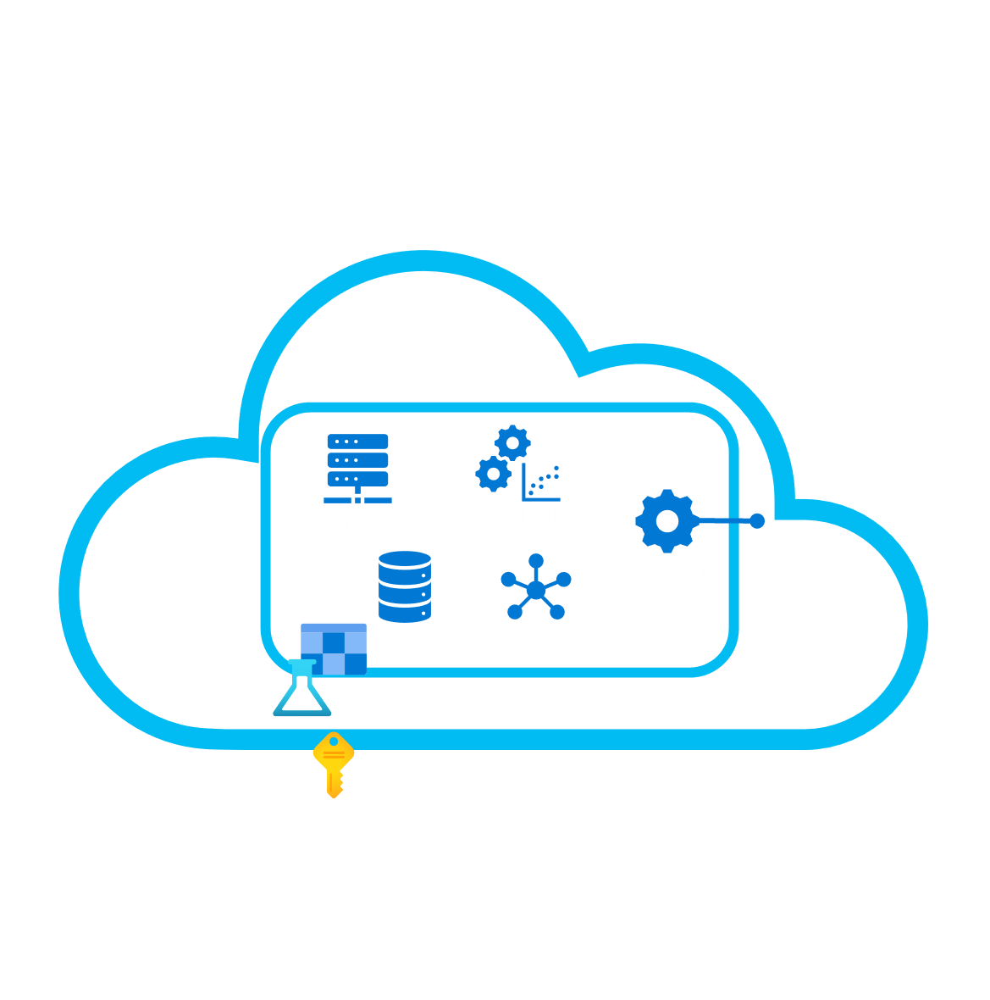
</p>
Precisamos fornecer os dados e o tipo de modelo supervisionado desejado e deixar o Azure Machine Learning encontrar o melhor modelo.

## 💻 Criar espaço de trabalho do Azure Machine Learning

````
Para utilizar os serviços de IA do Azure é necessário criar um Workspace.
• Será cobrada uma pequena quantidade de armazenamento de dados em sua assinatura do Azure enquanto o workspace do Azure Machine Learning existir.
• Portanto, recomendá-se que você exclua o workspace do Azure Machine Learning quando ele não for mais necessário.
````

- Acesse o [portal do Azure](https://portal.azure.com/).

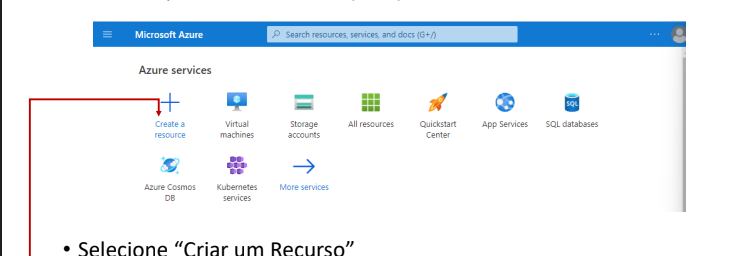

- Pesquise por Machine Learning
- Clique em Create - Azure Machinhe Learning
<p style=" text-align: center">
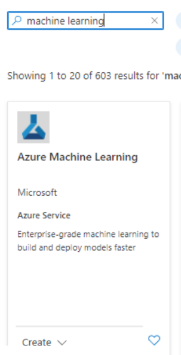
</p>

-  Selecione + Criar um recurso , pesquise por Machine Learning e crie um novo recurso do Azure Machine Learning com as seguintes configurações:
Assinatura : sua assinatura do Azure .

    * Grupo de recursos : crie ou selecione um grupo de recursos .
    * Nome : Insira um nome exclusivo para seu espaço de trabalho .
    * Região : Leste dos EUA.
    * Conta de armazenamento : observe a nova conta de armazenamento padrão que será criada para seu espaço de trabalho .
    * Cofre de chaves : observe o novo cofre de chaves padrão que será criado para seu espaço de trabalho .
    * Insights do aplicativo : observe o novo recurso padrão de insights do aplicativo que será criado para seu espaço de trabalho .
    * Registro de contêiner : Nenhum ( um será criado automaticamente na primeira vez que você implantar um modelo em um contêiner ).
<p style=" text-align: center">
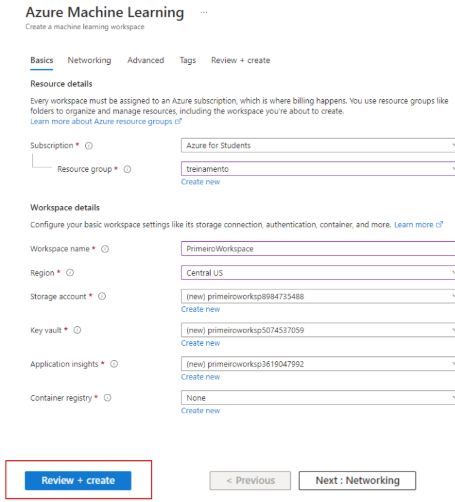
</p>
- Aguarde finalizar o processo
- Na página Visão geral do workspace, inicie o Estúdio do Azure Machine Learning (Launch Studio)

- ou abra uma nova guia do navegador e [acesse o estudio ML](https://ml.azure.com)

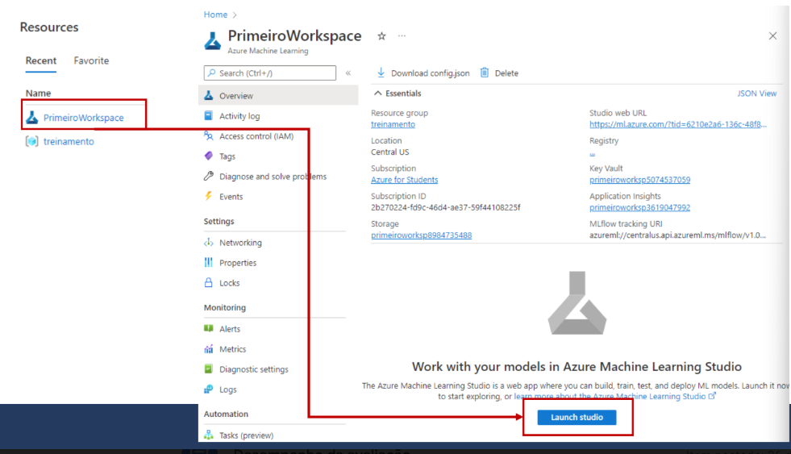

- Selecione Review + create e, em seguida, selecione Create . Aguarde a criação do seu workspace (pode levar alguns minutos) e, em seguida, vá para o recurso implantado.

- Selecione Launch studio (ou abra uma nova aba do navegador e navegue até [https://ml.azure.com](https://ml.azure.com) e entre no Azure Machine Learning Studio usando sua conta da Microsoft). Feche todas as mensagens que forem exibidas.

#  💻 Usando aprendizado de máquina automatizado para treinar um modelo

Já no Azure Machine Learning Studio, clique em ML automatizado (em Criação)
- Crie um novo trabalho de ML automatizado com as seguintes configurações, utilize o **avançar** conforme necessário

**Configurações básicas:**

- **Nome do trabalho:** mslearn-bike-ml
- **Nome do novo experimento:** mslearn-aluguel-de-bicicletas
- **Descrição:** machine learning automatizado para previsão de aluguel de bicicletas
- **Marcas:** nenhuma
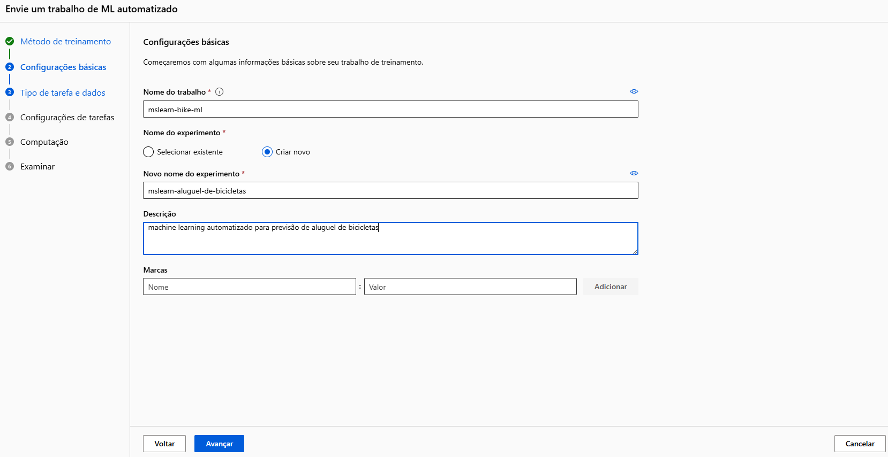

**Tipo de tarefa e dados:**

- **Selecionar tipo de tarefa:** regressão
- **Selecionar conjunto de dados:** crie um novo conjunto de dados com as seguintes configurações:
    - **Tipo de dados:**
        - **Nome:** alugueldebicicletas
        - **Descrição:** Historic bike rental data
        - **Tipo:** Tabela (mltable)

    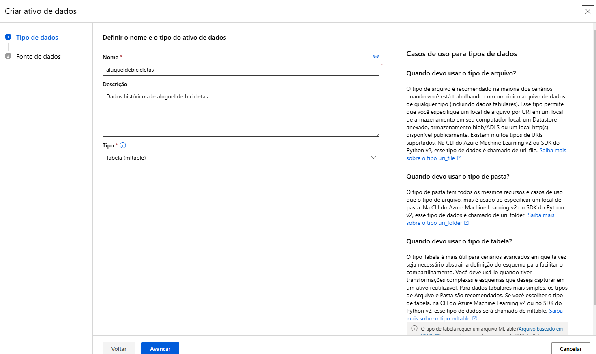
    - **Fonte de dados:**
        - **Selecionar Dos arquivos locais**
        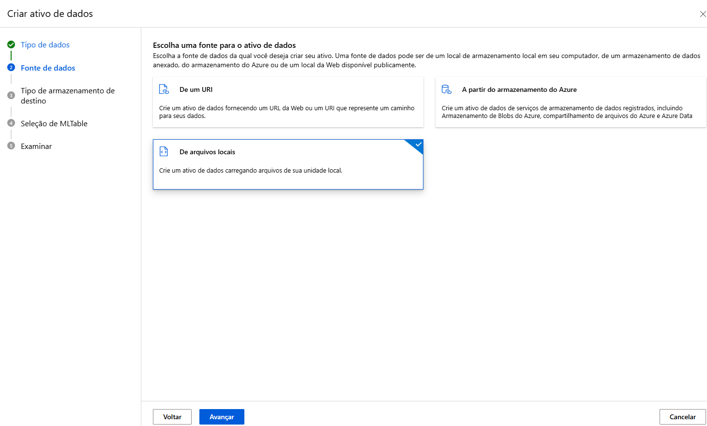

    - **Tipo de armazenamento de destino:**
        - **Tipo de armazenamento de dados:** Armazenamento do Blobs do Azure
        - **Nome:** workspaceblobstore
        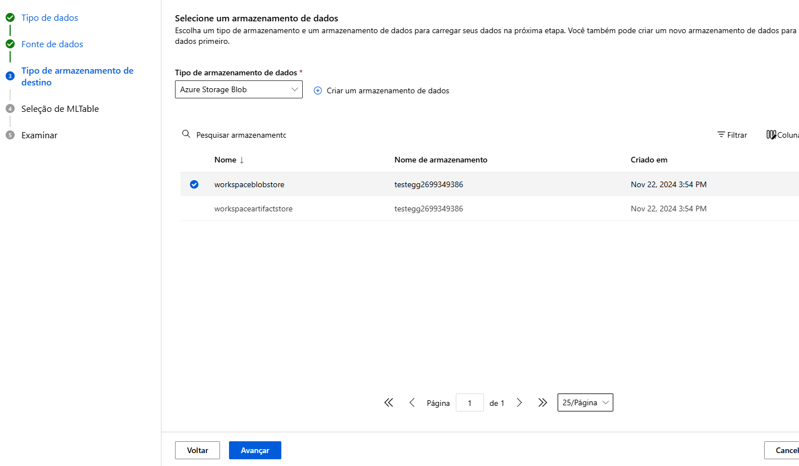
        - **Avançar**


    - **Seleção de MLtable:**
    
   > Carregar pasta: Baixe e descompacte a pasta contendo os dois arquivos necessários para carregar [https://aka.ms/bike-rentals](https://aka.ms/bike-rentals)

   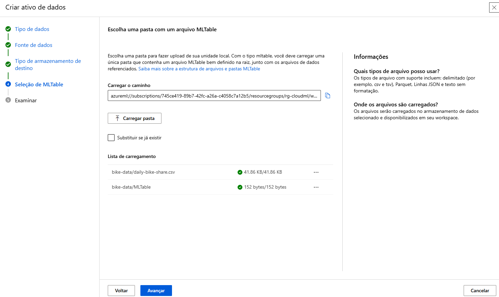

**Configurações da tarefa:**

- **Tipo de tarefa:** regressão
- **Conjunto de dados:** alugueldebicicletas
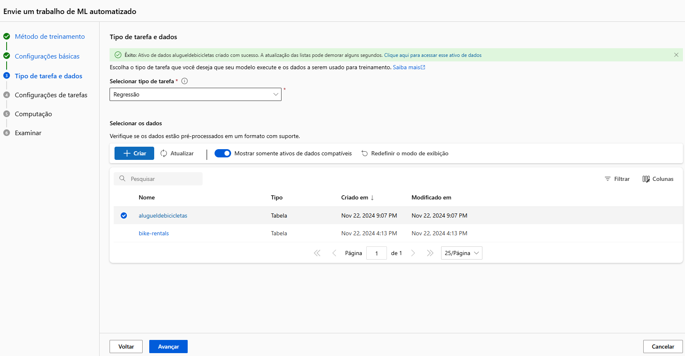
- **Coluna de destino:** aluguéis (inteiro)
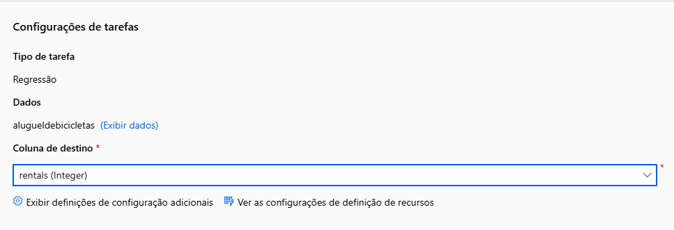
- **Definições de configuração adicionais:**
    - **Métrica primária:** NormalizedRootMeanSquaredError
    - **Explicar o melhor modelo:** não selecionado
    - **Habilitar empilhamento de conjunto:** Não selecionado
    - **Usar todos os modelos com suporte:** Nãoselecionado. Você restringirá o trabalho para experimentar apenas alguns algoritmos específicos.
    - **Modelos permitidos:** selecione apenas RandomForest e LightGBM. O ideal seria tentar usar o máximo possível, mas cada modelo adicionado aumenta o tempo necessário para executar o trabalho.

    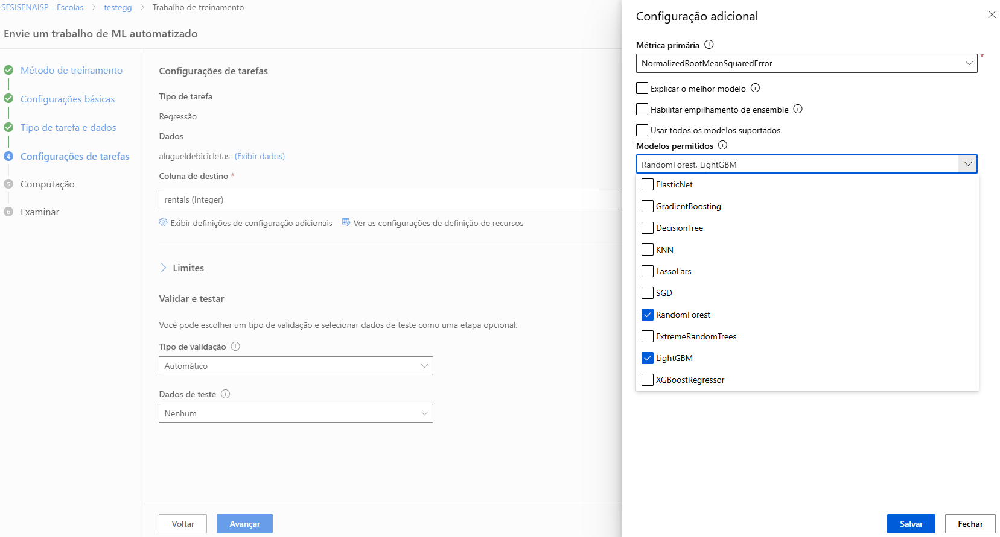

- **Limites:**  expanda esta seção
    - **Avaliações máximas:**  3
    - **Máximo de avaliações simultâneas:**  3
    - **Máximo de nós:**  3
    - **Limite de pontuação da métrica:**  0.085 (* de modo que se um modelo atingir uma pontuação de métrica de raiz do erro quadrático médio normalizada de até 0,085, o trabalho será encerrado.*)
    - **Tempo limite de eXPERIMENT:**  15
    - **Tempo limite de iteração:**  15
    - **Habilitar encerramento antecipado:**  selecionado
- **Validação e teste:** 
    - **Tipo de validação:**  divisão de validação de treinamento
    - **Percentual de dados de validação:**  10
    - **Conjunto de dados de teste:**  nenhum

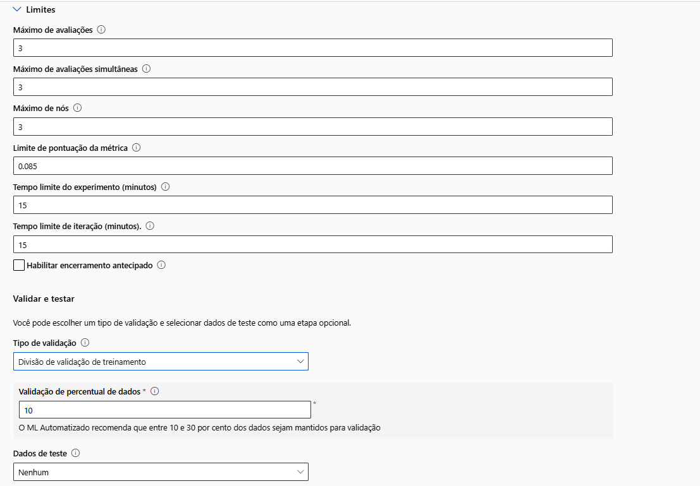

- **Computação:

- **Selecionar tipo de computação:**  sem servidor
- **Tipo de máquina virtual:**  CPU
- **Camada da máquina virtual:**  dedicada
- **Tamanho da máquina virtual:**  Standard_F8s_v2
- **Número de instâncias:**  2
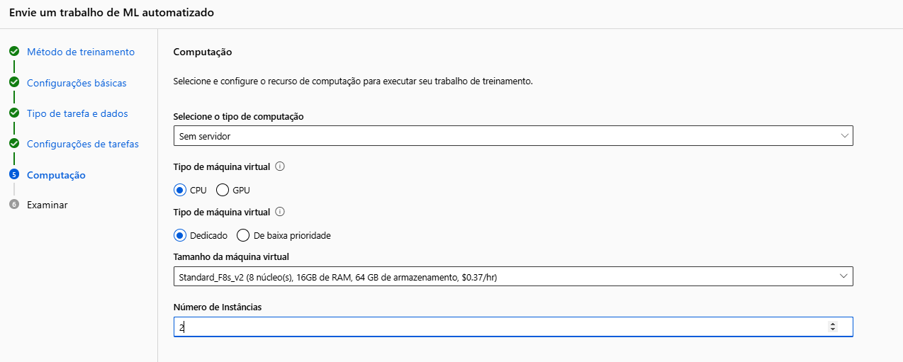

- **Clique** em **Avançar** e **Enviar trabalho de treinamento**
- Aguarde. Ele será iniciado automaticamente. (deve durar uns 15 a 20 min)

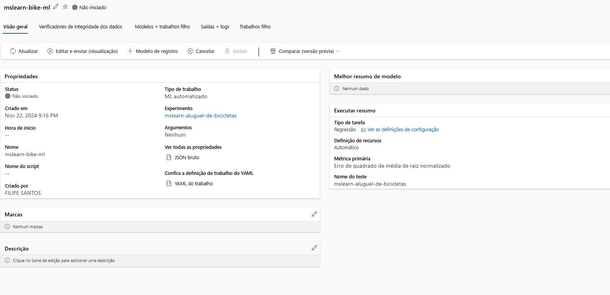

# Examinar o melhor modelo

Quando o trabalho de machine learning automatizado for concluído, você poderá examinar o melhor modelo treinado.

Na guia Visão geral do trabalho de machine learning automatizado, observe o resumo do melhor modelo.
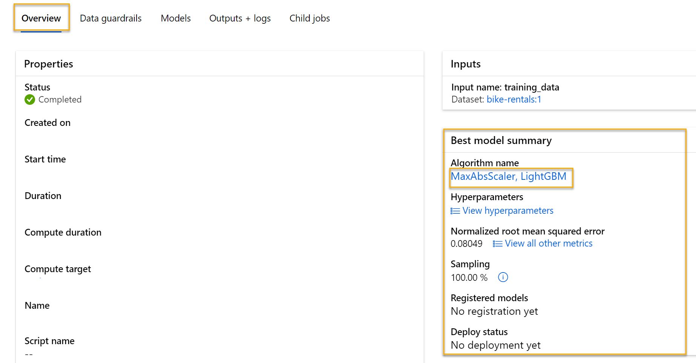

- Selecione o texto em Nome do algoritmo do melhor modelo para exibir os respectivos detalhes.

- Selecione a guia Métricas e selecione os gráficos residuais e predicted_true se eles ainda não estiverem selecionados.

- Examine os gráficos que mostram o desempenho do modelo. O gráfico de resíduos mostra os resíduos (as diferenças entre valores previstos e reais) como um histograma. O gráfico predicted_true compara os valores previstos com os valores verdadeiros.


## Implantar e testar o modelo

- Na guia Modelo para obter o melhor modelo treinado pelo trabalho de machine learning automatizado, selecione **Implantar** e use a opção **Terminal em tempo real** para implantar o modelo com as seguintes configurações:
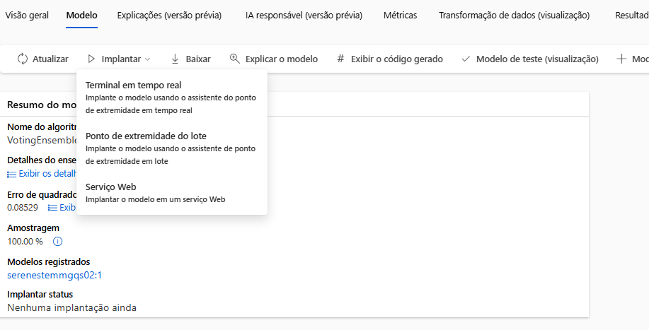

- **Máquina virtual:**  Standard_DS3_v2
- **Contagem de instâncias:**  3
- **Ponto de extremidade:**  Novo
- **Nome do ponto de extremidade:**  Deixe o padrão ou verifique se ele é globalmente exclusivo
- **Nome da implantação:**  Manter o padrão
- **Coleta de dados de inferência:**  Disabled
- **Empacotar modelo:**  Disabled

## Testar o Serviço Implantado


````
{
   "input_data": {
     "columns": [
         {
             "day": 1,
             "mnth": 1,   
             "year": 2022,
             "season": 2,
             "holiday": 0,
             "weekday": 1,
             "workingday": 1,
             "weathersit": 2, 
             "temp": 0.3, 
             "atemp": 0.3,
             "hum": 0.3,
             "windspeed": 0.3 
         }
     ],
     "index": [],
     "data": []
   }
 }
 ````

 - No painel Dados de entrada para testar o ponto de extremidade , substitua o JSON do modelo pelos seguintes dados de entrada:

 ````
 {
  "input_data": {
    "columns": [
      "day",
      "mnth",
      "year",
      "season",
      "holiday",
      "weekday",
      "workingday",
      "weathersit",
      "temp",
      "atemp",
      "hum",
      "windspeed"
    ],
    "index": [0],
    "data": [[1,1,2022,2,0,1,1,2,0.3,0.3,0.3,0.3]]
  }
}
 ````
 - Clique em Testar
 - Resultado:

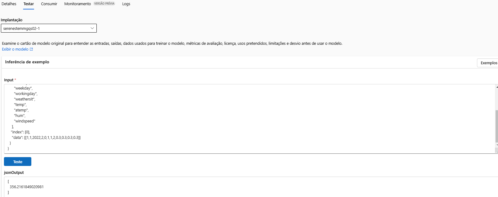

* Após finalizar não esqueça de excluir o grupo de recursos que você criou ao iniciar o projeto

### 📝 Referências

- [Explore o Machine Learning automatizado no Azure Machine Learning](https://microsoftlearning.github.io/mslearn-ai-fundamentals/Instructions/Labs/01-machine-learning.html)
- [Explorar o Machine Learning Automatizado no Azure Machine Learning](https://microsoftlearning.github.io/mslearn-ai-fundamentals.pt-br/Instructions/Labs/01-machine-learning.html)
- [AI-900](https://learn.microsoft.com/pt-br/credentials/certifications/azure-ai-fundamentals/?practice-assessment-type=certification)
