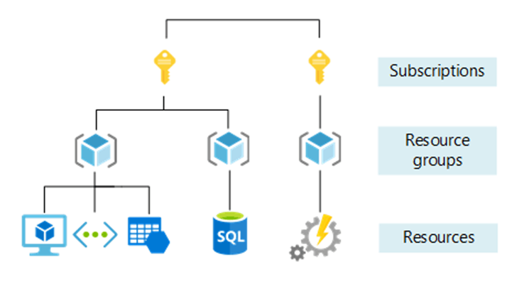

# 💻 Machine Learning

```
Modelos preditivos baseados em dados e estatísticas. Temos a ciência de dados e engenharia de software.
```


Exemplo: criança precisa aprender a comer, falar, andar etc., dessa forma precisamos cria um modelo que será inserido dentro software e treinar a aplicação. 

O aprendizado de máquina trabalha com informações, precisamos explorar os dados.

Quais são os dados que devo trazer para responder as questões?
```
Tem origem na estatística, dados históricos para prever o futuro.
```
- Qual o comportamento de um cenário, ambiente de uma cidade de uma empresa com base nas informações trazidas.
    - Exemplo: Vai acontecer uma feira de flores na cidade e tenho uma floricultura, como deverei prever a quantidade de flores que serão vendidas durante a feira.
```  
Exemplo: Trabalho com chocolates, qual a época que vende mais? Qual a região que mais vende, quais as pessoas que mais compraram
```
## ☁  Noções básicas do Azure
A plataforma de nuvem Azure da Microsoft, oferece serviços de computação em nuvem escalável e confiável.

```
“A computação em nuvem é a entrega de serviços de computação através da Internet.”
```

Necessário criar uma conta. Pode criar uma [conta gratuita de estudante](https://azure.microsoft.com/pt-br/free/students)
 
 


### 🤖 Serviços de IA no Azure


| Tipos | Descrição |
| :--- |:---|
| Aprendizado de Máquina Azure | Plataforma para treinar, implantar e gerenciar modelos de aprendizagem de máquina |
| Serviços de IA do Azure |	Conjunto de serviços que abrange visão, fala, linguagem, decisão e IA generativa |
| Pesquisa Cognitiva do Azure |	Extração, enriquecimento e indexação de dados para pesquisa inteligente e mineração de conhecimento |

### 📝 Referências

- [AI-900](https://learn.microsoft.com/pt-br/credentials/certifications/azure-ai-fundamentals/?practice-assessment-type=certification)