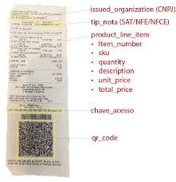

# Inteligência de Documentos - IA do Azure

> Problema: Notas Fiscais para comprovação de despesas para reembolso. 
 - Necessário guardar todos os comprovantes
 - Perda de alguma nota durante ou depois o percurso

 Os serviços de inteligência de documentos de IA do Azure, pode ajudar a resolver. 
 > Usando o rescurso de OCR, podemos adicionar todos os dados tirando uma foto e enviando para o sistema através de um aplicativo.

 

 Análise de Documentos:
 - Retorna representações de dados estruturados
 - Regiões de interesse e relacionamentos
 Configurar opções de análise para análise gratuita e cobrada

 # Modelos Predefinidos e Personalizados

 > "Os modelos predefinidos aplicam aprendizado de máquina avançado para identificar e extrair com precisão texto, pares de valores-chave, tabelas e estruturas de formulários e documentos"

 Principais documentos: serviços financeiros e jurídicos, impostos, hipotecas e documentos de identificação pessoal.
 detalhes de clientes e fornecedores de faturas
- detalhes de vendas e transações de recibos
- detalhes de identificação e verificação de documentos de identidade
- detalhes de planos de saúde
- detalhes de contatos comerciais
- detalhes de contratos e partes de contratos
remuneração tributável, juros hipotecários,
- detalhes de empréstimos estudantis e muito mais

Treinar o modelo para reconhecer dados em vários tipos de recibos diferetnes.
Campos como:
-  Nome, endereço e número de telefone do comerciante
- Data e hora da compra
- Nome, quantidade e preço de cada item comprado
- Total, subtotais e valores de impostos

> Cada campo e par de dados tem um nível de confiança, indicando o provável nível de precisão. Dados extraídos com uma alta pontuação de confiança podem ser usados para verificar automaticamente as informações em um recibo

- [Estúdo de Informaçõa de Documento](https://documentintelligence.ai.azure.com/studio)

Modelos Personalizados:

- Treine modelos com pelo menos cinco dados de amostra
- Identifique campos de interesse para sua organização

# Document Intelligence

Extrair informações de formulários digitalizados em formato de imagem ou PDF
