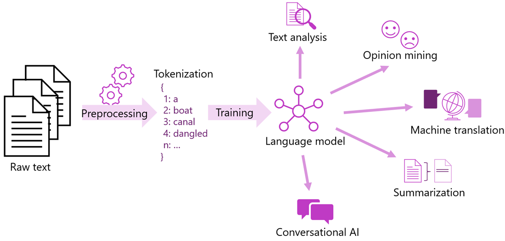

# Processamento de Linguagem Natual

````
"O NLP (processamento de linguagem natural) tem muitos usos: análise de sentimento, detecção de tópicos, detecção de idioma, extração de frases-chave e categorização de documentos."
````

Esse recurso permite automatizar diversas atividades da empresa, mandtendo uma comunicação personalizada e de qualidade.



Utilizamos o [Language Studio](https://language.cognitive.azure.com) para análise.

 
# Referências

* [Escolher uma tecnologia de processamento de linguagem natural](https://learn.microsoft.com/pt-br/azure/architecture/data-guide/technology-choices/natural-language-processing)