# Processamento de Linguagem Natural

PLN (Processamento de Linguagem Natural) - " uma área dentro da IA que trata da compreensão da linguagem escrita ou falada e de como responder à altura. A análise de texto descreve os processos de NLP que extraem informações de textos não estruturados."

Pode ser usada em:
- Um analisador de feed de mídia social que detecta o sentimento relativo a uma campanha de marketing de um produto.
- Um aplicativo de pesquisa de documentos que resume documentos em um catálogo.
- Um aplicativo que extrai marcas e nomes de empresas do texto


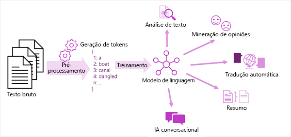

- Análise de texto, como extrair termos chave ou identificar entidades nomeadas no texto.
- Análise de sentimento e mineração de opiniões para categorizar o texto como positivo ou negativo.
- Tradução automática, na qual o texto é convertido automaticamente de um idioma para outro.
- Sumarização, na qual os principais pontos de um grande corpo de texto são resumidos.
- Soluções de IA de conversação, como bots ou assistentes digitais, nas quais o modelo de linguagem pode interpretar a entrada de linguagem natural e retornar uma resposta apropriada.

# Processamento de Linguagem Natural e IA conversacional no Azure

Vamos utilizar o [Language Studio](https://language.cognitive.azure.com).


* Realize o logon no Language Studio.
* Crie um novo recurso de idioma no portal do Azure

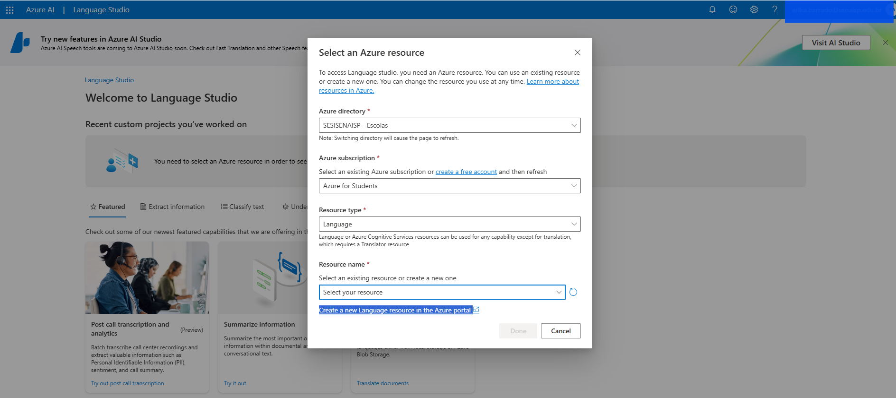

* Acesse o [Portal Azure]()
* Abra o Azure AI services

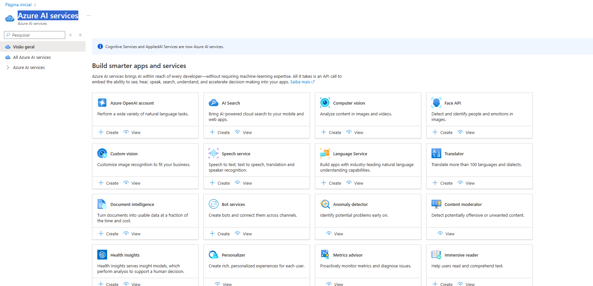

* Clique em **Create** no recurso: **Language Service** - "Serviço de Linguagem" 

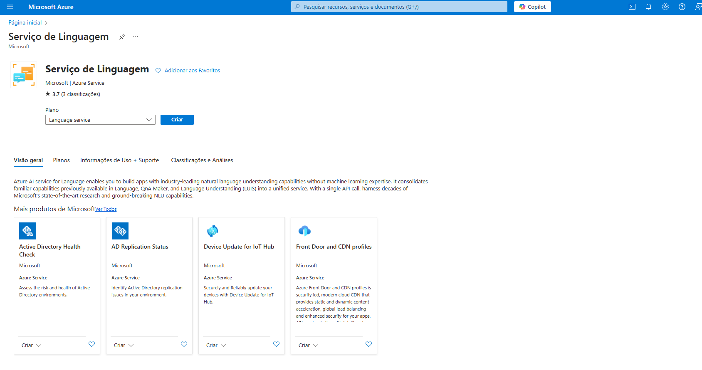
* Avance para próxima tela.

Na próxima tela será necessário criar:
* Grupo de Recurso: rg-language-ba

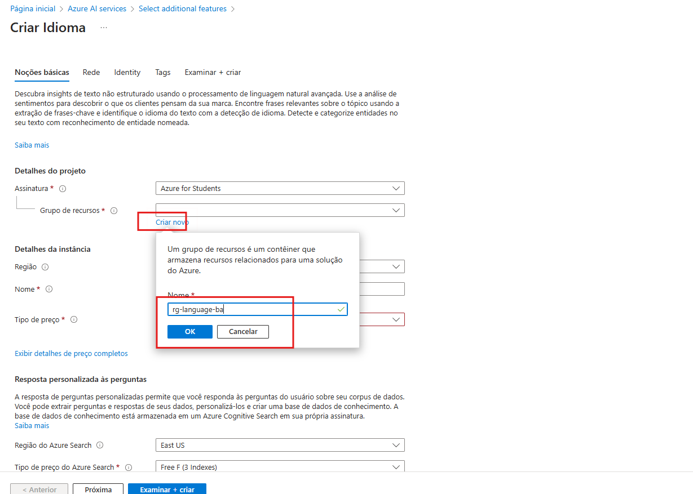

* Região: East US
* Nome do recurso: language-ba
* Tipo de preço: Free F0 (5K Transctions per 30 days)

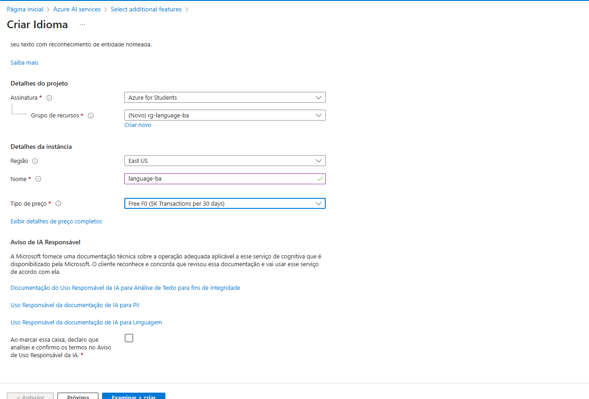

* Clique em **Examinar e Criar** e depois em **Criar**

Após criar volte ao **Language Service**

* Clique em **Classify Text**- Classificação de Texto
* Clique em **Analyze sentiment and opinions** - Analisar sentimentos e opiniões

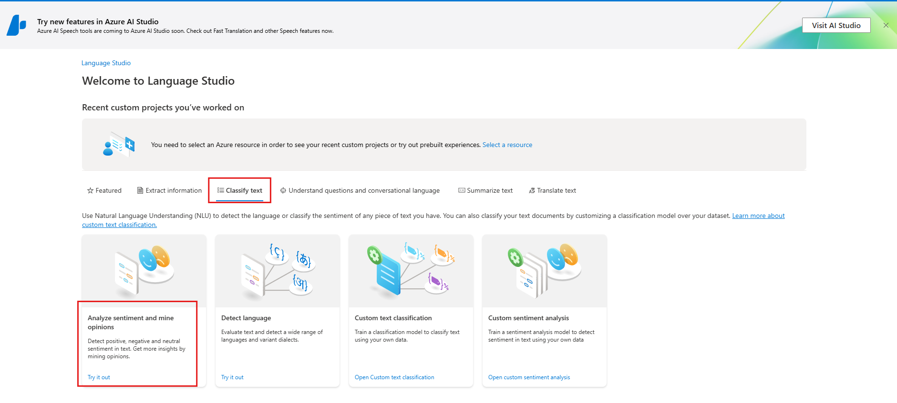
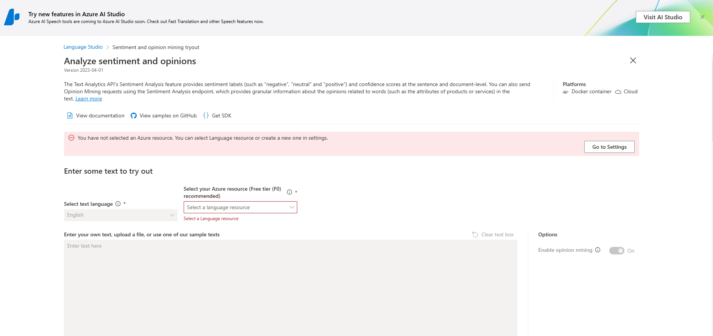
````
Importante
Se ainda não selecionou e recurso criado no Portal do Azure - Selecione-o agora. 
````

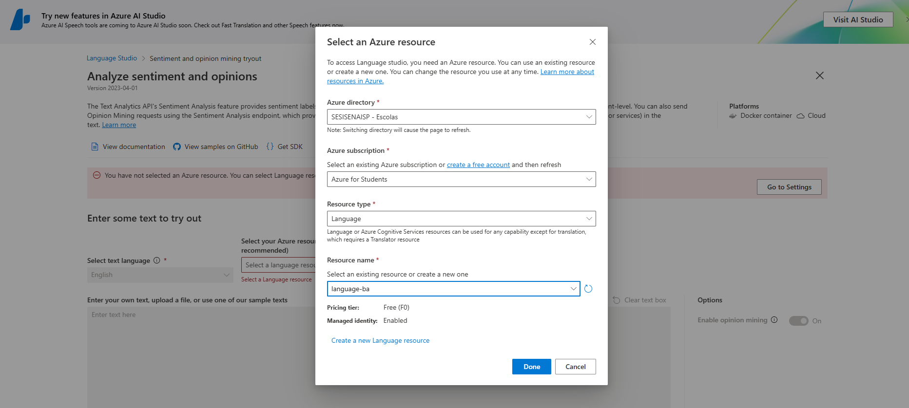

* Em Selecionar idioma do texto , selecione Inglês .

* Em Selecione seu recurso do Azure , selecione seu recurso.

* Em Insira seu próprio texto, carregue um arquivo ou use um texto de exemplo:

```
 Tired hotel with poor service
 The Royal Hotel, London, United Kingdom
 5/6/2018
 This is an old hotel (has been around since 1950's) and the room furnishings are average - becoming a bit old now and require changing. The internet didn't work and had to come to one of their office rooms to check in for my flight home. The website says it's close to the British Museum, but it's too far to walk.
````

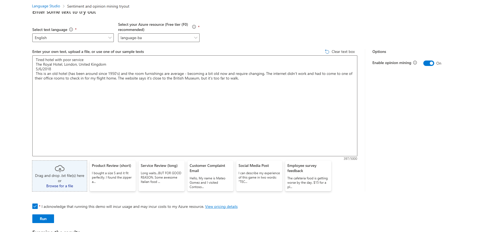
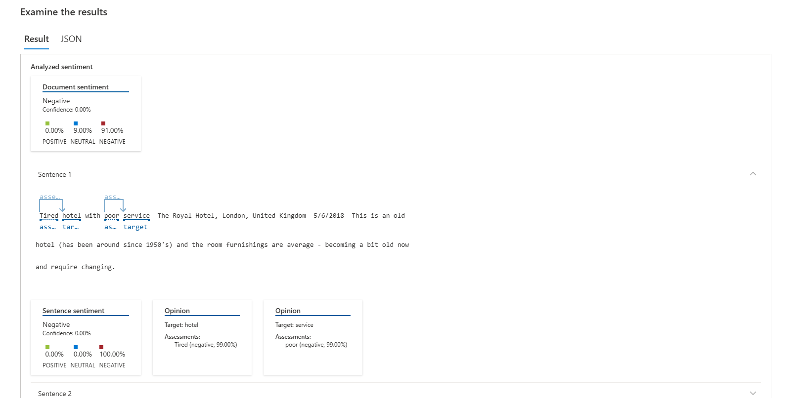
* ou utilize um exemplo de texto em português para realziar a análise. Como no exemplo
 * Procure uma recomendação de restaurante na Internet e copie para análisar o sentimento descrito.

 ````
Restaurante de comida muito boa, não comi nada lá ainda que não fosse bom, fui no almoço dessa vez, porém o cheiro da fumaça das churrasqueiras me incomodou, e fiquei cheirando dps, ou seja, vc vai trabalhar cheirando defumado. Carnes são top, e risoto tbm.
Só penso em voltar pq não gosto de ficar cheirando comida.
 ````
 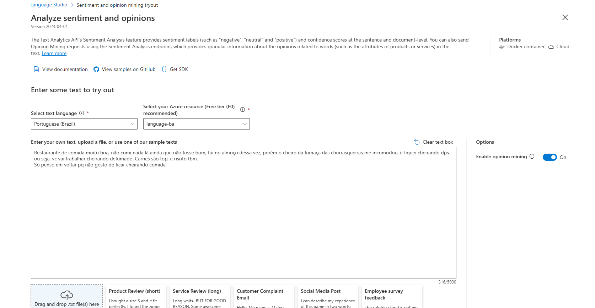
 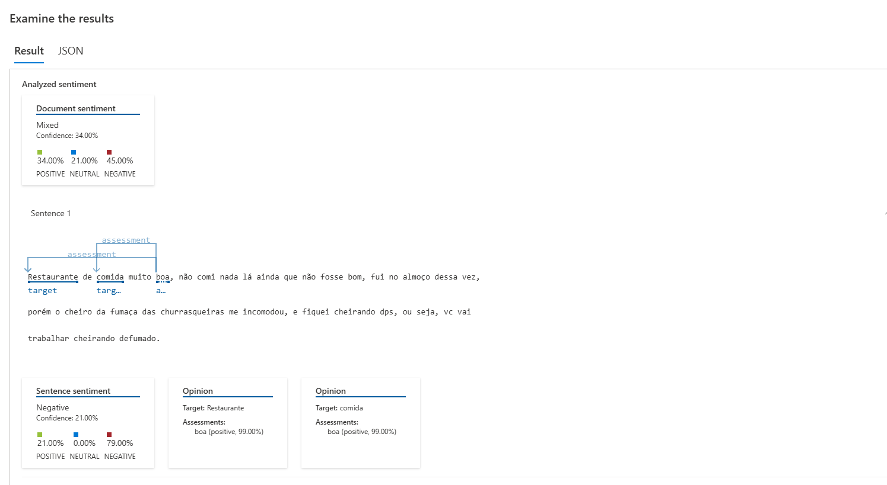


# Referências

- [Analisar texto com o Language Studio](https://microsoftlearning.github.io/mslearn-ai-fundamentals/Instructions/Labs/06-text-analysis.html)

* [AI - 900 (Conceitos básicos da Análise de Texto com o Serviço de Linguagem)](https://learn.microsoft.com/pt-br/training/modules/analyze-text-with-text-analytics-service/)
